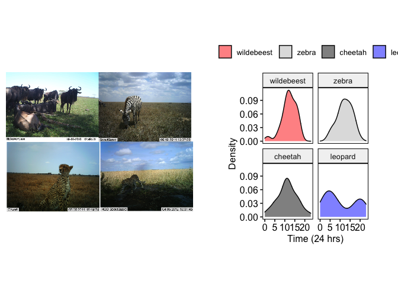

<!-- README.md is generated from README.Rmd. Please edit that file -->

# Welcome to the GitHub page for the ‘behaviouR’ package



## Getting started

To download the package from GitHub enter the following lines of code
into R.

``` r
# Install devtools from CRAN
install.packages("devtools")
devtools::install_github("https://github.com/DenaJGibbon/behaviouR")
```

## Accessing R scripts

The full tutorials (include scripts as appendices) can be found here:
<https://bookdown.org/djc426/behaviouR-R-package-tutorials/>.

Links to individual R Scripts can be found here:
<https://github.com/DenaJGibbon/behaviouRtutorials/tree/master/R%20Scripts%20for%20Labs>

## Modifying course materials for instructors

You can find and modify the source code for the tutorials by visiting
<https://github.com/DenaJGibbon/behaviouRtutorials> and downloading a
.zip file. See <https://bookdown.org/yihui/bookdown/> for information on
how to modify the code.
