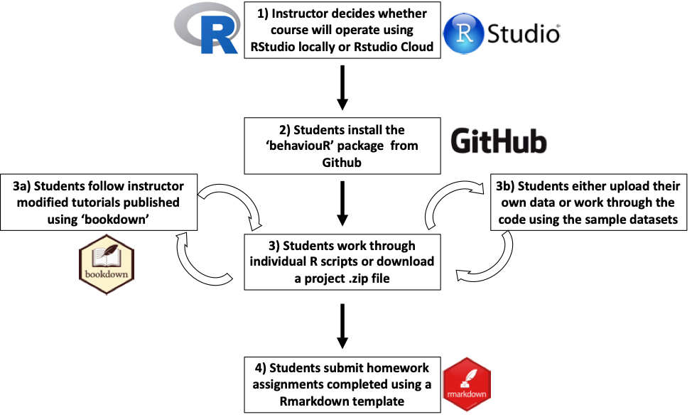

<!-- README.md is generated from README.Rmd. Please edit that file -->

# Welcome to the GitHub page for the ‘behaviouR’ package

## Recommended workflow for instructors



## Getting started

To download the package from GitHub enter the following lines of code
into R.

``` r
# Install devtools from CRAN
install.packages("devtools")
devtools::install_github("https://github.com/DenaJGibbon/behaviouR")
```

## Accessing R scripts

The full tutorials (include scripts as appendices) can be found here:
<https://bookdown.org/djc426/behaviouR-R-package-tutorials/>.

## Modifying course materials for instructors

You can find and modify the source code for the tutorials by visiting
<https://github.com/DenaJGibbon/behaviouRtutorials> and downloading a
.zip file. See <https://bookdown.org/yihui/bookdown/> for information on
how to modify the code.

## Homework templates

Rmarkdown scripts and sample .pdfs of the homework templates can be
found here:
<https://github.com/DenaJGibbon/behaviouRtutorials/tree/master/HomeworkTemplates>.

## Data sheets

If instructors wish to follow the field labs and have students enter
their own data they can use the following code to export the data to a
.csv file locally. This will ensure that datasheets are in the correct
format.

``` r
data("MeerkatFocalData")
write.csv(MeerkatFocalData,'MeerkatFocalData.csv', row.names = F)

data("MeerkatScanData")
write.csv(MeerkatScanData,'MeerkatScanData.csv', row.names = F)

data("BarnacleGooseData")
write.csv(BarnacleGooseData,'BarnacleGooseData.csv', row.names = F)

data("CensusData")
write.csv(CensusData,'CensusData.csv', row.names = F)
```
